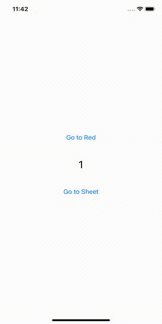

# RouterExample

[SwiftUI Router](https://github.com/ReactComponentKit/Router) Example🚀

## Example



## Example Code

```swift
import SwiftUI
import Router
import Defaults

@main
struct RouterExampleApp: App {
    
    @Default(.isFirstLaunch)
    var isFirstLaunch
    
    var body: some Scene {
        WindowGroup {
            RouterRootView { router in
                Switch(isFirstLaunch)
                    .Case(true) { _ in
                        OnboardingView()
                    }
                    .Case(false) { _ in
                        ContentView()
                    }
                    .Else {
                        EmptyView()
                    }
            }
            .path("myapp://onboarding1") { _ in
                OnboardingView()
            }
            .path("myapp://onboarding2") { _ in
                OnboardingView2()
            }
            .path("myapp://content") { _ in
                ContentView()
                    .navigationBarHidden(true)
            }
            .path("myapp://content.as.root") { _ in
                ContentView()
                    .navigationBarHidden(true)
                    .asRouterRootView()
            }
            .path("myapp://counter") { data in
                CounterView(count: data.bindings.count)
            }
            .path("myapp://color") { data in
                If<String>(data.color).Let { color in
                    ColorView(color:  MyColor.from(string: color))
                        .navigationBarHidden(true)
                }
// or                
//                Switch<String>(data.color)
//                    .Case("red") { color in
//                        ColorView(color:  MyColor.from(string: color))
//                            .navigationBarHidden(true)
//                    }
//                    .Case("green") { color in
//                        ColorView(color:  MyColor.from(string: color))
//                            .navigationBarHidden(true)
//                    }
//                    .Else {
//                        Text("OMG")
//                    }
            }
        }
    }
}
```

## ColorView

```swift
import SwiftUI
import Router

enum MyColor: String {
    case red
    case green
    case blue
    case yellow
    case purple
    case white
}

struct ColorView: View {
    @EnvironmentObject
    var router: Router
    
    var color: MyColor = .white
    
    var body: some View {
        VStack(spacing: 48) {
            switch color {
            case .red:
                Button("Go to Green") {
                    router.route("myapp://color?color=green", .push)
                }
            case .green:
                Button("Go to Blue") {
                    router.route("myapp://color?color=blue", .push)
                }
            case .blue:
                Button(action: { router.route("myapp://color?color=yellow", .push) }) {
                    Text("Go to Yellow")
                        .foregroundColor(.white)
                }
            case .yellow:
                Button("Go to Purple") {
                    router.route("myapp://color?color=purple", .push)
                }
            case .purple:
                Button("Go to White") {
                    router.route("myapp://color?color=white", .push)
                }
            default:
                Button("Go to Red") {
                    router.route("myapp://color?color=red", .push)
                }
            }
            
            Button(action: { router.route("myapp://content.as.root", .sheet) }) {
                Text("Go to Sheet")
                    .foregroundColor(.black)
            }
                        
            Button(action: { router.popToRoot() }) {
                Text("Pop To Root")
                    .foregroundColor(.black)
            }
        }
        .frame(maxWidth: .infinity, maxHeight: .infinity)
        .background(makeColor(color: color).ignoresSafeArea())
    }
    
    private func makeColor(color: MyColor) -> Color {
        switch color {
        case .red:
            return Color.red
        case .blue:
            return Color.blue
        case .green:
            return Color.green
        case .yellow:
            return Color.yellow
        case .purple:
            return Color.purple
        case .white:
            return Color.white
        }
    }
}
```